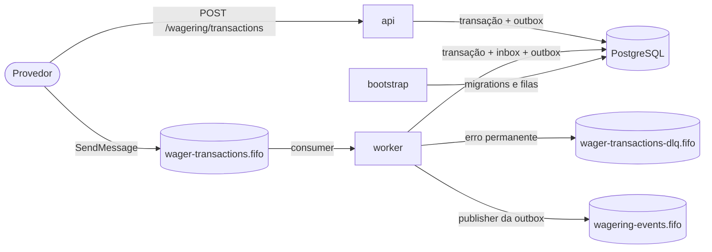
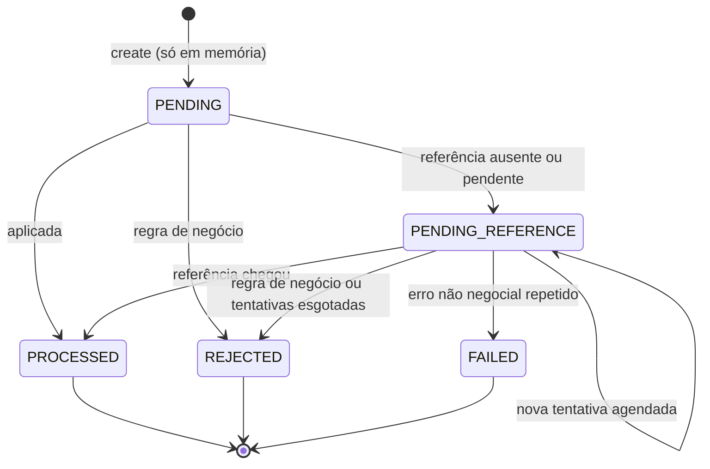

# Arquitetura — Wagering Processor

Processador de transações de aposta de vários provedores, com entrada por HTTP e por SQS FIFO e o PostgreSQL como árbitro. Este documento justifica as decisões pedidas no [CHALLENGE.md](CHALLENGE.md) e registra trade-offs e limitações. Setup e comandos estão no [README](README.md).

**Invariante central:** `wallet.balance` é sempre igual ao saldo reconstruído pelo ledger, sem débito ou crédito duplicado e sem saldo negativo, com mensagens duplicadas, fora de ordem, simultâneas, várias instâncias e processos caindo no meio.

## 1. Visão geral

| Processo | Responsabilidade |
|---|---|
| `bootstrap` | aplica as migrations e cria as três filas; roda uma vez, antes dos outros |
| `api` | HTTP: wallets, transações, ledger, reconciliação, health e métricas |
| `worker` | consumidor da fila de entrada, publisher da outbox e scheduler de referências pendentes |

As instâncias se coordenam **só pelo PostgreSQL**: lock de linha na wallet, `FOR UPDATE SKIP LOCKED` na outbox, constraints UNIQUE e triggers. Nada em memória é garantia; o FIFO e a deduplicação do SQS são otimizações.

O código separa domínio (`src/wallet/domain`, `src/messaging/domain`), aplicação (casos de uso e portas) e infraestrutura (MikroORM, HTTP, SQS). O ESLint impede domínio e aplicação de importar NestJS, MikroORM, AWS SDK ou `pg`, e proíbe nessas camadas `Number()`, `parseFloat`, `parseInt` e `toNumber`.

As versões (Bun 1.3.14, NestJS 12.1.2, MikroORM 7.2.3, PostgreSQL 18.6, MiniStack 1.5.20) foram fixadas por um spike com testes próprios em `test/spike/`.

## 2. ORM: MikroORM

É a opção preferencial do enunciado e oferece o que a estratégia transacional precisa sem contornos: `em.transactional` com isolamento explícito, `LockMode.PESSIMISTIC_WRITE` e `SKIP LOCKED`, `nativeUpdate` com o número de linhas afetadas e migrations programáticas.

O uso é deliberadamente explícito, para cada instrução SQL de uma operação financeira ficar visível no código:
- entidades definidas com `defineEntity`, sem decorators, fora do domínio, convertidas por funções que chamam `rehydrate`;
- leituras sem identity map e escritas explícitas (`insert`, `insertMany`, `nativeUpdate` com versão esperada); não há flush implícito;
- migrations escritas à mão, com `up` e `down`, executadas sem a CLI do ORM.

## 3. Money

- **No domínio:** `Money` é imutável, com o valor em `big.js` (modo estrito, sem conversão implícita de `number`) e a moeda ISO-4217. Entra e sai como string com exatamente 2 casas.
- **Entradas recusadas:** NaN, Infinity, notação científica, vazio, mais de 2 casas e negativos. `10.5` e `10.005` são recusados, nunca arredondados.
- **No banco:** duas colunas, valor `numeric` e moeda `text` com `CHECK` de três letras maiúsculas. O valor não tem precisão declarada e tem `CHECK (scale(col) = 2)`, sinal e magnitude menor que 10^17.
- **Por que sem precisão:** com `numeric(p,2)`, o PostgreSQL arredondaria `10.005` em silêncio antes de qualquer `CHECK`. Sem precisão, a escrita é recusada. O driver devolve o valor como string exata.
- **Limite:** um crédito que levaria o saldo a 10^17 é rejeitado com `BALANCE_LIMIT_EXCEEDED` antes de chegar ao banco.

## 4. Estratégia transacional

Um único caso de uso (`SubmitWagerTransaction`) atende HTTP e SQS. Cada operação é uma unidade de trabalho: um fork do EntityManager, uma transação READ COMMITTED com `lock_timeout` de 3 s. Transações aninhadas são recusadas, porque no MikroORM a interna viraria savepoint e uma falha poderia ser engolida.

1. **Fora da transação:** valida o contrato e calcula o hash do payload.
2. Na entrada SQS, registra a inbox (mesmo hash: entrega duplicada; hash diferente: conflito).
3. Busca a idempotency key do provedor: mesmo hash é replay; hash diferente é conflito.
4. `SELECT … FOR UPDATE` na wallet, nova busca pela key sob o lock e busca por `(provider_id, external_transaction_id)`.
5. Decisão pura da `SettlementPolicy`, com a referência resolvida sob o mesmo lock.
6. Escritas: transação (com o saldo observado) → wallet com versão esperada → lançamento → eventos na outbox → inbox processada.
7. Commit.

Inbox, transação, saldo, ledger e outbox entram juntos, ou nada entra. Uma violação de UNIQUE (corrida com a mesma key) refaz a unidade uma vez, e a segunda execução vira replay ou conflito. Deadlock refaz no máximo duas vezes. `lock_timeout` vira 503 na API ou backoff na fila.

## 5. Concorrência

A unidade de concorrência é a wallet, e uma wallet disputada é o caso normal.

| Estratégia | A favor | Contra | Uso |
|---|---|---|---|
| `SELECT … FOR UPDATE` na wallet | serializa por wallet sem tempestade de retries | a espera ocupa uma conexão | **base** |
| otimista com retry (`version`) | não espera | sob disputa gera retries em cascata | só como verificação: `UPDATE … WHERE version = :esperada` exigindo 1 linha |
| update atômico condicional | uma instrução | não serializa as checagens de idempotência e de referência | não |
| SERIALIZABLE | simples | falhas de serialização sob disputa | não |
| advisory lock por hash | — | colisões serializam wallets sem relação | não |

- **READ COMMITTED:** depois de esperar o lock, o PostgreSQL devolve a linha já atualizada. Em REPEATABLE READ, o mesmo cenário falha com erro de serialização.
- **Ordem de locks:** toda rota de escrita trava a wallet antes de qualquer linha de transação, e cada unidade de trabalho trava uma única wallet. Na fila, a inbox vem antes da wallet. Não há ciclo possível.
- **Sem lock global:** wallets diferentes nunca se esperam.
- **Lost update:** três camadas independentes: o lock, a versão esperada no `UPDATE` e `UNIQUE (wallet_id, wallet_version)` no ledger.

## 6. Invariantes no schema

| Garantia | Mecanismo |
|---|---|
| uma wallet por `playerId` + `currency` | `UNIQUE (player_id, currency)` |
| saldo nunca negativo | `CHECK` de sinal e escala no saldo e no ledger |
| idempotência | `UNIQUE (provider_id, idempotency_key)` e `UNIQUE (provider_id, external_transaction_id)` |
| um lançamento por transação e wallet | `UNIQUE (wallet_id, transaction_id)` |
| sem lost update | `UNIQUE (wallet_id, wallet_version)` |
| reversão uma vez por tipo | índice único parcial `(reference_transaction_id, kind)` para REFUND e ROLLBACK processados |
| ledger imutável | triggers que recusam `UPDATE`, `DELETE` e `TRUNCATE` |
| transação terminal imutável | trigger que recusa mudar linha PROCESSED, REJECTED ou FAILED; `DELETE` recusado |
| moeda coerente | FKs compostas `(wallet_id, currency)` e `(transaction_id, wallet_id, currency)` |
| conta do lançamento | `CHECK balance_after = balance_before ± amount` |
| saldo igual ao ledger | constraint triggers `DEFERRABLE INITIALLY DEFERRED`, conferidas no commit |
| mensagem processada uma vez | PK `(consumer_name, message_id)` na inbox |

As duas constraint triggers ficam para o commit porque a wallet e o lançamento são gravados em comandos separados da mesma transação. `wallets_balance_matches_ledger` exige que o saldo seja o `balance_after` do lançamento da versão atual; `wallet_ledger_entries_follow_chain` exige que cada lançamento continue o anterior. Custo medido: 1% a 2% da vazão de pico.

**Migrations em tabela grande:** índice com `CREATE INDEX CONCURRENTLY`; troca de `CHECK` com `NOT VALID` e `VALIDATE` em comandos separados. Numa cópia com 5 milhões de transações, a troca numa transação só parou leitura e escrita por cerca de 0,4 s.

## 7. Idempotência

- **Key:** o header `Idempotency-Key` é obrigatório e é a fonte da verdade, com escopo no provedor.
- **payloadHash:** SHA-256 em hex do JSON canônico RFC 8785 (`canonicalize`) dos campos de negócio: `providerId`, `externalTransactionId`, `playerId`, `walletId`, `roundId`, `gameId`, `kind`, `money` e `referenceExternalTransactionId`, quando existe. Header, `messageId`, `occurredAt` e `correlationId` ficam de fora. A aposta do exemplo do enunciado gera `629836932b79106b99523d06a1e7fa80689b0ea1e1c47aa3f0a5a2c87d0c4344`.
- **Replay:** de transação terminal, devolve a resposta original, com o status HTTP e o saldo daquele momento; de transação pendente, o estado atual.
- **Conflito:** mesma key com outro payload é 409 `IDEMPOTENCY_KEY_CONFLICT` (DLQ na fila); mesmo id externo com outra key é 409 `EXTERNAL_TRANSACTION_CONFLICT`.
- **Inbox:** o hash da mensagem cobre `{type, data}`; o mesmo `messageId` com outro conteúdo vai para a DLQ.
- **HTTP e fila** compartilham as mesmas constraints: a mesma operação pelos dois canais gera um efeito só.

## 8. Máquina de estados

Estados terminais são imutáveis no domínio (`InvalidTransactionStateError`) e no banco (trigger). Só o scheduler grava numa transação pendente.

## 9. Regras de negócio e failureCodes

| Tipo | Saldo | Ledger | Referência | Regras |
|---|---|---|---|---|
| BET | − valor | 1 DEBIT | proibida | saldo ≥ valor |
| WIN | + valor | 1 CREDIT | opcional (BET) | validada se vier |
| LOSS | 0 | nenhum | opcional (BET) | aceita valor zero |
| REFUND | + valor | 1 CREDIT | obrigatória: BET | mesmo valor; referência PROCESSED; uma vez |
| ROLLBACK | inverso da referência | 1 invertido | obrigatória: BET, WIN ou REFUND | mesmo valor; uma vez; débito exige saldo |
| OPENING | + saldo inicial | 1 CREDIT | — | só interno, criado por `POST /wallets` |

**Ordem das validações:** wallet existe → o player é o dono → moeda → referência → saldo.

| failureCode | Quando | Status | HTTP |
|---|---|---|---|
| `INSUFFICIENT_FUNDS` | BET maior que o saldo | REJECTED | 422 |
| `REVERSAL_INSUFFICIENT_FUNDS` | ROLLBACK de crédito maior que o saldo | REJECTED | 422 |
| `CURRENCY_MISMATCH` | moeda diferente da wallet | REJECTED | 422 |
| `WALLET_PLAYER_MISMATCH` | o player não é o dono da wallet | REJECTED | 422 |
| `REFERENCE_MISMATCH` | referência de outro provedor, player, wallet, rodada ou moeda | REJECTED | 422 |
| `INVALID_REFERENCE_KIND` | tipo de referência não permitido | REJECTED | 422 |
| `REFERENCE_AMOUNT_MISMATCH` | valor diferente da referência | REJECTED | 422 |
| `REFERENCE_NOT_PROCESSED` | referência REJECTED ou FAILED, ou ainda pendente quando as tentativas acabam | REJECTED | 422 |
| `REFERENCE_ALREADY_REVERSED` | a referência já tem reversão PROCESSED do mesmo tipo | REJECTED | 422 |
| `REFERENCE_NOT_FOUND` | a referência não chegou dentro das tentativas | REJECTED | 422 (replay) |
| `BALANCE_LIMIT_EXCEEDED` | crédito que levaria o saldo a 10^17 | REJECTED | 422 |
| `PROCESSING_FAILED` | falha repetida que não é de negócio nem transitória | FAILED | 500 (replay) |

A reversão sem saldo tem código próprio porque é uma situação operacional diferente da aposta sem saldo.

## 10. API e status HTTP

Se a transação foi gravada, o corpo é o resultado `{transactionId, status, balance, failureCode?, idempotentReplay}`. Se nada foi gravado, o corpo é `application/problem+json` com `code` estável e `retryable`. Um filtro global aplica a mesma tabela em todas as rotas.

| Situação | HTTP | Código |
|---|---|---|
| processada | 200 | resultado |
| aceita, aguardando referência | 202 | resultado, com `Location` |
| rejeitada por regra de negócio | 422 | resultado com `failureCode` |
| payload ou requisição inválida | 400 | `INVALID_PAYLOAD`, `INVALID_REQUEST`, `INVALID_CURSOR`, `IDEMPOTENCY_KEY_REQUIRED`, `UNSUPPORTED_KIND`, `REFERENCE_REQUIRED`, `REFERENCE_NOT_ALLOWED`, `INVALID_AMOUNT` |
| sem token, token inválido, sem permissão | 401, 403 | `AUTHENTICATION_REQUIRED`, `INVALID_TOKEN`, `ACCESS_DENIED` |
| recurso inexistente | 404 | `WALLET_NOT_FOUND`, `TRANSACTION_NOT_FOUND`, `NOT_FOUND` |
| conflito de idempotência | 409 | `IDEMPOTENCY_KEY_CONFLICT`, `EXTERNAL_TRANSACTION_CONFLICT`, `WALLET_ALREADY_EXISTS`, `DUPLICATE_WAGER_TRANSACTION` |
| corpo grande demais | 413 | `PAYLOAD_TOO_LARGE` |
| erro inesperado, nada gravado | 500 | `INTERNAL_ERROR`, `retryable: true`: reenviar com a mesma key é seguro |
| falha transitória de infraestrutura | 503 | `SERVICE_UNAVAILABLE`, `retryable: true`, `Retry-After` |
| limite de streams da réplica | 503 | `STREAM_CAPACITY_EXCEEDED`, `retryable: true`, `Retry-After` |

O ledger (`GET /wallets/:walletId/ledger`) usa cursor opaco preso à wallet, do lançamento mais novo para o mais antigo, com `limit` de 1 a 100. Abrir de novo uma wallet existente devolve 409 com o `walletId` dela.

## 11. Processamento por SQS

Fila `wager-transactions.fifo`, mensagem `WagerTransactionRequested` com o mesmo contrato do HTTP. Fluxo: validar o envelope → unidade de trabalho com inbox, idempotência, lock e escritas → commit → `DeleteMessage`. Um rollback descarta a inbox junto: a mensagem nunca fica processada sem o efeito.

| Desfecho | Ação |
|---|---|
| processada, rejeitada, pendente, replay ou duplicata | commit e ack |
| inválida, OPENING, conflito de `messageId`, de key ou de id externo, wallet inexistente | DLQ com o motivo |
| erro transitório | sem ack; visibilidade com backoff de 2 s dobrando até 120 s; na 8ª tentativa, DLQ `RETRIES_EXHAUSTED` |
| PostgreSQL inacessível | como transitório, e o consumidor pausa até o banco voltar |

- **Ordem:** mensagens do mesmo grupo (`walletId`) em sequência; grupos diferentes em paralelo.
- **Heartbeat:** a cada 10 s, a visibilidade das mensagens retidas é estendida. Se o processo morre, elas reaparecem.
- **DLQ:** a mensagem só sai da origem depois do envio confirmado para `wager-transactions-dlq.fifo`. A `RedrivePolicy` com 10 recebimentos é a rede de segurança contra crash em loop. `bun run dlq` lista e reprocessa.
- **SIGTERM:** o consumidor termina as mensagens em andamento e devolve as não iniciadas com visibilidade zero.

## 12. Outbox e eventos

Os eventos são gravados em `outbox_messages` na mesma transação do efeito. Um loop do worker publica em `wagering-events.fifo`:

1. `SELECT … FOR UPDATE SKIP LOCKED` de até 10 eventos vencidos: vários publishers nunca pegam a mesma linha.
2. `SendMessageBatch` com `MessageGroupId` = `walletId` e `MessageDeduplicationId` = `eventId`.
3. Um único `UPDATE` grava o desfecho do lote: publicado, ou nova tentativa com backoff de 1 s até 5 min.
4. Commit.

Nenhum evento sai antes do commit da operação, e nenhum é descartado. Se o publisher cai entre o envio e o commit, outro reenvia com o mesmo `eventId`: duplicata possível, perda impossível.

| Evento | Quando |
|---|---|
| `WagerTransactionProcessed` | qualquer transação aplicada, inclusive LOSS |
| `WagerTransactionRejected` | rejeição por regra, inclusive referência expirada |
| `WalletBalanceChanged` | somente quando o saldo muda, com `walletVersion` |
| `WagerTransactionPendingReference` | referência ausente |
| `WagerTransactionFailed` | uma pendente vira FAILED |

O envelope é uma classe abstrata com uma subclasse por evento; `eventType` e `version` ficam no tipo, e `data` carrega `MoneyProps`. A entrega é at-least-once e FIFO por wallet na ordem de publicação; o consumidor deduplica por `eventId` e usa `walletVersion` para detectar lacunas.

## 13. Referências pendentes

Uma operação cuja referência ainda não existe é gravada como `PENDING_REFERENCE` e responde 202.

- **Worker agendado:** busca as pendentes vencidas e reprocessa cada uma com a mesma ordem de locks e a mesma `SettlementPolicy` do caminho síncrono. Dois schedulers na mesma pendente se serializam no lock da wallet.
- **Limite:** 10 novas verificações, com backoff de 2 s dobrando até 120 s e jitter, de 5 a 10 minutos no total. Esgotado, vira REJECTED com `REFERENCE_NOT_FOUND` e publica `WagerTransactionRejected`.
- **Por que esse limite:** entrega fora de ordem vem de redelivery e de publicação concorrente no provedor, e costuma se resolver em segundos ou poucos minutos. A janela cobre isso sem deixar a operação pendente por tempo indefinido.
- **Falhas:** erro transitório não conta tentativa. Erro não negocial repetido três vezes vira FAILED com `PROCESSING_FAILED`.

## 14. Reconciliação

`POST /wallets/:walletId/reconciliation` lê numa única consulta o saldo gravado, as somas do ledger, a contagem de lançamentos e as quebras de cadeia. Responde os campos do enunciado (`walletId`, `storedBalance`, `calculatedBalance`, `difference`, `consistent`, `checkedEntries`) e mais `chainBreaks` e `versionConsistent`. Divergência nunca é corrigida: gera log de erro, a métrica `wallet_reconciliation_divergences_total` e `consistent: false`. A CLI `bun run reconcile` faz o mesmo em todas as wallets.

## 15. Observabilidade

- **Logs:** JSON (pino) com `correlationId`, `messageId`, `transactionId`, `walletId` e `providerId`. Nunca levam valores, saldos, payloads nem `playerId`; o pino ainda censura esses campos.
- **Métricas** (`GET /metrics`, formato Prometheus):

| Pedido no enunciado | Métricas |
|---|---|
| transações por status | `wager_transactions_total` |
| duplicatas detectadas | `idempotency_replays_total`, `inbox_duplicates_total` |
| retries | `db_transaction_retries_total`, `sqs_message_retries_total`, `outbox_publish_retries_total`, `pending_reference_retries_total` |
| mensagens em DLQ | `sqs_messages_dead_lettered_total`, `sqs_dlq_approximate_messages` |
| conflitos de lock | `wallet_lock_wait_seconds`, `wallet_lock_timeouts_total`, `db_deadlocks_total`, `wallet_version_conflicts_total` |
| outbox lag | `outbox_publish_delay_seconds`, `outbox_oldest_pending_age_seconds`, `outbox_pending_events` |
| latência de processamento | `wager_processing_duration_seconds`, `http_request_duration_seconds` |

- **Health:** `GET /health/live` (processo de pé) e `GET /health/ready` (PostgreSQL e SQS alcançáveis), ambos sem autenticação.

## 16. Desligamento e falhas

- **SIGTERM:** o readiness passa a 503; o consumidor termina o que está em andamento e devolve o resto; o publisher termina o lote; o servidor HTTP termina as requisições; o pool do PostgreSQL espera as transações ativas.
- **SIGKILL:** a transação aberta sofre rollback, a mensagem sem ack reaparece depois da visibilidade e o lote da outbox sem commit volta a ficar pendente.
- **PostgreSQL fora:** a API responde 503 sem gravar nada; o consumidor pausa; publisher e scheduler entram em backoff.
- **SQS fora:** as escritas continuam e a outbox acumula; o consumidor e o publisher entram em backoff.

## 17. Autenticação

Implementada com um IdP externo, o **Keycloak 26.8**, no Compose, com o realm `wagering` em `keycloak/wagering-realm.json`. Todos os clientes são sistemas, então todos usam `client_credentials`.

- A api valida a assinatura RS256 pelo JWKS, o emissor, a audiência e a expiração a cada requisição.
- `POST /wagering/transactions` exige que o `provider_id` do token seja o `providerId` do corpo. As rotas de wallet exigem o papel `operator`, e `/metrics`, o papel `metrics-reader`.
- Health continua aberto. A fila é canal interno confiável, como o enunciado permite, e o `providerId` da mensagem passa pelas mesmas regras de domínio.

## 18. Testes

Os testes rodam contra PostgreSQL e MiniStack reais; cada suíte cria o próprio banco e filas. Todo teste que opera o sistema termina com um verificador que confere, em cada wallet: saldo = ledger, cadeia contínua, versão coerente, um lançamento por transação que move saldo e nenhuma reversão duplicada.

| Cenário do enunciado | Teste |
|---|---|
| 1. mesma aposta 50 vezes em paralelo | `concurrency/in-process/same-bet-fifty-times`, `multi-process/http-instances`, `multi-process/mixed-load` |
| 2. disputa pelo saldo (100.00 contra 2 × 80.00) | `in-process/competing-bets` (25 rodadas), `multi-process/http-instances` |
| 3. wallets distintas em paralelo | `in-process/distinct-wallets` |
| 4. três ou mais processos | `multi-process/mixed-load` (3 apis e 3 workers) |
| 5. worker morto depois do commit e antes do ack | `multi-process/shutdown-matrix` |
| 6. dois publishers na mesma outbox | `multi-process/outbox-publishers`, `multi-process/shutdown-matrix` |
| 7. ROLLBACK ou REFUND antes da referência | `in-process/pending-references`, `multi-process/reference-schedulers` |
| 8. reinício com consistência final | `multi-process/restart` |

Os testes de integração cobrem migrations e constraints (cada uma violada com o SQLSTATE esperado), atomicidade, inbox e redelivery, publishers concorrentes, retry e DLQ. A CI roda lint, typecheck, a suíte, o spike e o e2e em toda PR.

## 19. Interpretações do enunciado

- **Reversões:** no máximo uma reversão PROCESSED por referência e por tipo (regra 7.4, literal). Um REFUND e um ROLLBACK da mesma BET são ambos aceitos, porque são operações distintas, cada uma aplicada uma vez.
- **WIN e LOSS** aceitam referência opcional a uma BET, validada se vier.
- **Replay de pendente** devolve o estado atual (202), e depois a resposta terminal com `idempotentReplay: true`.
- **Três situações separadas:** FAILED só para transação gravada que falha repetidamente no processamento assíncrono; indisponibilidade vira 503 ou backoff sem gravar nada; mensagem inválida ou conflitante vai para a DLQ sem virar transação.
- **`PENDING`** existe só em memória; **`WALLET_NOT_FOUND`** não é gravado (não há wallet para a FK); **OPENING** usa o provedor reservado `internal`.
- **Idempotency key** com escopo no provedor: o enunciado não fixa o escopo, e a key global deixaria um provedor descobrir, pelo 409, keys de outro.
- **Moeda:** o modelo é multi-moeda, e os conflitos de moeda são testados; os exemplos usam BRL.

## 20. Além do enunciado

- **Stream em tempo real:** `GET /wallets/:walletId/events` (SSE) entrega saldo e lançamentos commitados, com retomada por `Last-Event-ID`.
- **Retenção:** um loop do worker apaga eventos publicados e mensagens processadas antigos, em lotes, com uma réplica por vez.
- **Painel de métricas:** Prometheus e Grafana no profile `observability` do Compose.
- **Teste de carga:** `bun run test:load`, com metodologia e resultados em [LOAD-TEST.md](LOAD-TEST.md).

## 21. Trade-offs e limitações

- **Wallet muito disputada** serializa no lock da linha: a vazão por wallet é limitada pela duração da transação. `lock_timeout` de 3 s vira 503 ou backoff.
- **Transação do publisher aberta durante o envio ao SQS:** mantém o claim simples com `SKIP LOCKED`, ao custo de segurar linhas da outbox (nunca a wallet) por até 5 s.
- **Ordem dos eventos** é a de publicação, não a de commit; o consumidor usa `eventId` e `walletVersion`.
- **Contador de falhas do scheduler em memória:** com N instâncias, chegar a FAILED pode levar até N vezes mais tentativas, e um restart zera a contagem. Só afeta o caminho de erro não negocial.
- **Reconciliação lê o ledger inteiro da wallet:** cerca de 0,6 s por milhão de lançamentos; com o `statement_timeout` de 10 s, cabem uns 10 milhões de lançamentos por wallet.
- **Várias apis** são provadas pelos testes; o Compose não tem balanceador.
- **MiniStack não é o SQS real:** latência e limites da AWS são outros, e os números de fila do teste de carga medem o emulador.
- **Keycloak:** sem ele, nenhum cliente obtém token novo; a api segue validando pelo cache de chaves enquanto os tokens emitidos valem (5 minutos). O realm é importado só na primeira subida.

**Ambiente local × produção.** O Compose é o ambiente local. Fora dele:
- **PostgreSQL:** `shared_buffers` em cerca de 25% da RAM, `effective_cache_size` de 50% a 75%, `max_wal_size` dimensionado pelo WAL entre checkpoints, `checkpoint_timeout` de 15 min e `wal_compression=lz4`. Com os padrões da imagem, uma base de 1 milhão de wallets tinha checkpoints que dominavam a cauda de latência ([LOAD-TEST.md](LOAD-TEST.md)).
- **Keycloak:** TLS, `KC_HOSTNAME` no endereço público e segredos gerados e guardados num cofre; o JWKS só por HTTPS ou rede interna confiável.
- **api:** o Bun usa um núcleo por processo; escalar horizontalmente, com um balanceador na frente.
- **SQS:** o real, com a DLQ e a redrive policy criadas pelo bootstrap.
