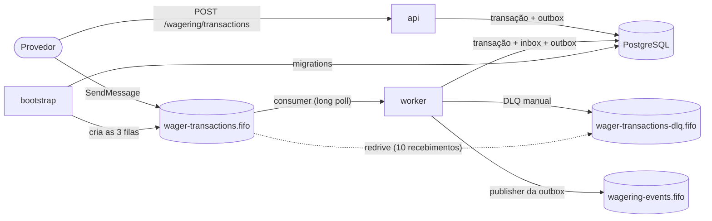
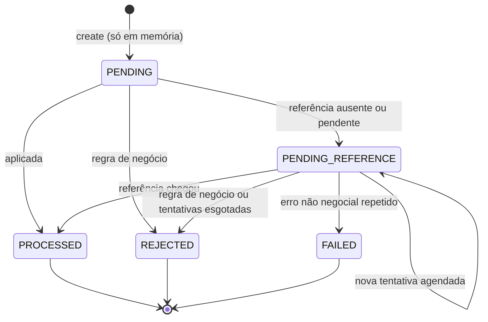

# Arquitetura — Wagering Processor

Processador de transações de aposta (BET, WIN, LOSS, REFUND, ROLLBACK) de vários provedores, com entrada por HTTP e por SQS FIFO e o PostgreSQL como árbitro. Este documento explica o desenho, as garantias e onde cada uma é provada por teste. O passo a passo para subir e testar o sistema fica no [README](README.md), e o enunciado do desafio, sem alterações, em [CHALLENGE.md](CHALLENGE.md).

Invariante central: em qualquer situação, `wallet.balance` é igual ao saldo reconstruído pelo ledger, sem débito ou crédito duplicado e sem saldo negativo — com mensagens duplicadas, fora de ordem, simultâneas, com várias instâncias e com processos caindo no meio.

## Visão geral

| Papel | Entrypoint | Responsabilidade |
|---|---|---|
| `bootstrap` | `src/main.bootstrap.ts` | aplica as migrations pendentes e cria as três filas FIFO; idempotente; roda uma vez antes dos outros |
| `api` | `src/main.api.ts` | HTTP (wallets, transações, ledger, reconciliação), health e métricas |
| `worker` | `src/main.worker.ts` | consumidor da fila de entrada, publisher da outbox e scheduler de referências pendentes, cada um ligado ou desligado por variável de ambiente; health e métricas |

As instâncias se coordenam **só pelo PostgreSQL**: lock de linha na wallet, `FOR UPDATE SKIP LOCKED` na outbox, constraints UNIQUE e o trigger de imutabilidade. Nada em memória é garantia; o FIFO e a deduplicação do SQS são otimizações.

| Pasta | Conteúdo |
|---|---|
| `src/wallet` | domínio (`Money`, `Wallet`, `WagerTransaction`, `SettlementPolicy`, eventos), aplicação (casos de uso e portas) e infraestrutura (MikroORM, HTTP, consumidor SQS, scheduler) |
| `src/messaging` | inbox e outbox (domínio e persistência), publisher, consumidor genérico em lote, provisionamento de filas |
| `src/platform` | configuração, banco (ORM, migrations, unidade de trabalho), HTTP (filtro de problemas, correlação), autenticação, ciclo de vida |
| `src/observability` | métricas Prometheus, logger pino, health |
| `src/shared` | portas transversais (relógio, ids, métricas, logger, unidade de trabalho) e backoff |
| `src/app` | composição dos módulos Nest de cada papel |

O ESLint impõe as fronteiras: domínio e aplicação não importam NestJS, MikroORM, AWS SDK, `pg` nem infraestrutura; o domínio não importa a aplicação; nessas camadas, `Number()`, `parseFloat`, `parseInt` e `toNumber` são proibidos, para o dinheiro nunca virar `number`. Os imports usam aliases (`@wallet/*`, `@platform/*`…), sem caminhos relativos para pastas acima.

## Matriz de versões validada

| Componente | Versão | Como foi validada |
|---|---|---|
| Bun (runtime, gerenciador de pacotes, test runner) | 1.3.14, local e imagem `oven/bun:1.3.14-alpine` | toda a suíte roda com `bun test` |
| TypeScript (só checagem de tipos) | 6.0.3 | `tsc --noEmit` limpo |
| NestJS | 12.1.2 (`common`, `core`, `platform-express`, `testing`) | injeção de dependências por metadados de decorators e validação com Standard Schema |
| Zod | 4.6.5 | `@Body({ schema })` com `StandardSchemaValidationPipe` |
| MikroORM | 7.2.3 (`core`, `postgresql`, `migrations`) | migrations, locks e códigos de erro contra PostgreSQL real |
| JSON canônico | `canonicalize` 5.1.0 (RFC 8785) | vetores de teste calculados por fora com `shasum` |
| Driver `pg` | 8.23.0, trazido pelo `@mikro-orm/postgresql` | NUMERIC devolvido como string |
| PostgreSQL | 18.6 (`postgres:18.6-alpine`) | locks, CHECK de escala e `lock_timeout` |
| AWS SDK (SQS) | `@aws-sdk/client-sqs` 3.1145.0 | todas as operações usadas pelo consumidor e pelo publisher |
| Emulador SQS | MiniStack 1.5.20 | ver evidências abaixo |
| Métricas e logs | `prom-client` 15.1.3, `pino` 10.3.1 | catálogo exposto em `/metrics`; logs JSON |
| Lint e formatação | ESLint 10.11.0 com typescript-eslint 8.71.0; Prettier 3.9.9 | `bun run lint` limpo |
| Orquestração | Docker 29.8.1, Docker Compose v5.5.1 | stack completa com healthchecks e `--scale worker=3` |

**Por que TypeScript 6.0.3 e não 7.0.2.** O TypeScript 7 é o compilador reescrito em Go. O typescript-eslint 8.71 aceita apenas versões abaixo de 6.1. Como o Bun transpila o código sozinho, o TypeScript só faz a checagem de tipos, e a escolha não afeta o comportamento em execução.

## Evidências do spike

Os testes ficam em `test/spike/` e rodam com `bun run test:spike` (requer `bun run infra:up`).

### NestJS 12 no Bun

- A injeção de dependências por construtor funciona com os metadados emitidos pelo Bun (`emitDecoratorMetadata`).
- `@Body({ schema })` com um schema Zod e o `StandardSchemaValidationPipe` global devolve 400 para um corpo inválido. O mesmo schema valida HTTP e mensagens SQS.

### MikroORM 7 com PostgreSQL 18

| Comportamento | Resultado |
|---|---|
| Migration escrita à mão, executada por `orm.migrator` com `migrationsList`: up, down e up de novo | funciona, sem CLI e sem transpilador extra |
| Valor NUMERIC com 17 dígitos inteiros | volta como string exata |
| Coluna `numeric` sem escala declarada com `CHECK (scale(col) = 2)` recebendo `10.005` | recusada com SQLSTATE `23514`, sem arredondar |
| Dois `findOne` com `LockMode.PESSIMISTIC_WRITE` na mesma linha | o segundo espera o commit do primeiro e enxerga o valor atualizado (READ COMMITTED) |
| Lock pessimista fora de transação | recusado pelo MikroORM |
| `SET LOCAL lock_timeout` estourado | erro com SQLSTATE `55P03` |
| Chave duplicada | erro com SQLSTATE `23505` |
| `em.transactional` chamado dentro de outro | vira savepoint: a falha interna é absorvida e a transação externa faz commit |

O último resultado explica por que a unidade de trabalho da aplicação recusa transações aninhadas: com o padrão `NESTED`, uma falha numa parte da operação poderia ser engolida enquanto o resto é confirmado.

### MiniStack 1.5.20 (SQS FIFO)

Cada comportamento foi testado numa fila própria, para uma falha não contaminar a outra.

| Comportamento de que o consumidor depende | Resultado |
|---|---|
| `ApproximateReceiveCount`, `MessageGroupId` e atributos de mensagem no recebimento | presentes e corretos |
| Segundo envio com o mesmo `MessageDeduplicationId` e o mesmo corpo | descartado |
| Mensagens do mesmo grupo enquanto uma delas está em processamento | retidas até a primeira ser apagada |
| `ChangeMessageVisibility` para zero | a mensagem volta na hora, com contagem 2 |
| `ChangeMessageVisibility` estendendo o prazo (heartbeat) | a mensagem continua escondida |
| Redrive com `maxReceiveCount` 2 | a mensagem vai para a DLQ FIFO |
| Long polling de 2 s numa fila vazia | a chamada espera o intervalo |
| `SendMessageBatch` | resultado separado por entrada |
| Envio manual para a DLQ com grupo, id de deduplicação e atributos; `ApproximateNumberOfMessages`, `…NotVisible` e `…Delayed` | funciona |

**Divergência encontrada.** Um segundo envio com o mesmo id de deduplicação mas corpo diferente faz o MiniStack responder com o MD5 do corpo original, e o SDK recusa a resposta com `InvalidChecksumError`. Não afeta o desenho: retries reais reenviam o mesmo corpo, a deduplicação do broker é só otimização e os testes de idempotência usam ids de deduplicação distintos de propósito.

### Desligamento (SIGTERM)

| Cenário | Resultado |
|---|---|
| Processo `bun src/main.api.ts` recebendo SIGTERM | o hook de shutdown do NestJS roda e o processo termina |
| Container iniciado diretamente pelo Bun, com `--init` | para na hora, código de saída 143, hook executado |
| Container com o Bun como PID 1, sem `--init` | para na hora, código de saída 0, hook executado |

O processo é iniciado diretamente pelo Bun no `Dockerfile` e no Compose (forma exec), sem script intermediário que possa interceptar o sinal.

### Compatibilidade com Bun 1.4.2

O Bun 1.4 reescreveu o runtime, e a versão mais recente é a 1.4.2. O spike rodou num container `oven/bun:1.4.2-alpine`, sem alterar o runtime local:

| Verificação | Resultado |
|---|---|
| `bun install --frozen-lockfile` com o lockfile atual | instala sem alterar o lockfile |
| Os 20 testes de `test/spike` | todos passam |
| `tsc --noEmit` e `eslint .` | limpos |
| Imagem da api construída com `--build-arg BUN_VERSION=1.4.2`, parada com SIGTERM | com `--init`, saída 143; como PID 1, saída 0; hook executado nos dois |

O projeto segue no 1.3.14 enquanto o runtime local estiver nessa versão. O `Dockerfile` recebe a versão por `ARG BUN_VERSION`, então adotar a 1.4.2 é trocar um valor e atualizar o Bun local.

## Schema e garantias no banco

A migration `src/platform/database/migrations/migration-20261002120000-create-wagering-schema.ts` é escrita à mão, com `up` e `down`, e roda pelo papel `bootstrap` ou por `bun run migrate:up` / `migrate:down` (sem CLI do ORM). Toda constraint, índice e trigger tem nome explícito, e os testes conferem o SQLSTATE e o nome da constraint violada.

**Mapeamento do Money.** Duas colunas: valor `numeric` e moeda `text` com `CHECK` de três letras maiúsculas. O valor não tem precisão declarada e tem `CHECK (scale(col) = 2)`, sinal e magnitude menor que 10^17. Com `numeric(p,2)` o PostgreSQL arredondaria `10.005` em silêncio antes de qualquer CHECK; sem precisão declarada, a escrita é recusada. Na aplicação, o valor é uma string decimal convertida para `big.js` dentro de `Money`, e volta do driver como string exata.

| Garantia do enunciado | Mecanismo no schema |
|---|---|
| uma wallet por `playerId` + `currency` | `UNIQUE (player_id, currency)` |
| saldo nunca negativo | `CHECK` de sinal e escala em `wallets.balance_amount` e nos saldos do ledger |
| idempotência | `UNIQUE (idempotency_key)` global e `UNIQUE (provider_id, external_transaction_id)` |
| no máximo um lançamento por transação e por wallet | `UNIQUE (wallet_id, transaction_id)` |
| sem lost update | `UNIQUE (wallet_id, wallet_version)` no ledger |
| reversão uma única vez por tipo (regra literal do enunciado §7.4) | índice único parcial `(reference_transaction_id, kind) WHERE status = 'PROCESSED' AND kind IN ('REFUND','ROLLBACK')` |
| ledger imutável | triggers `BEFORE UPDATE OR DELETE` e `BEFORE TRUNCATE` levantam `23001` |
| transação terminal imutável | trigger `BEFORE UPDATE` recusa qualquer alteração em linha PROCESSED, REJECTED ou FAILED e qualquer mudança nas colunas imutáveis; `DELETE` também é recusado |
| moeda do lançamento igual à da wallet e à da transação | FKs compostas `(wallet_id, currency)` e `(transaction_id, wallet_id, currency)` |
| conta do lançamento | `CHECK` de `balance_after = balance_before ± amount` conforme a direção |
| mensagem processada uma vez por consumidor | PK `(consumer_name, message_id)` na inbox |

Outras coerências checadas no banco: status `PENDING` nunca é gravado (só existe em memória); `failure_code` existe se e somente se o status é REJECTED ou FAILED; `processed_at` só em PROCESSED; `next_reference_attempt_at` só em PENDING_REFERENCE; `reference_transaction_id` existe se e somente se a transação foi processada e declarou referência; o provedor reservado `internal` só aparece em OPENING; o saldo observado fica sempre na moeda da wallet.

**Testes.** `test/integration/platform/database/` roda up → down → up e viola cada constraint e cada trigger com o SQLSTATE esperado. Um cruzamento com o catálogo do PostgreSQL confirmou que toda constraint tem um teste com o seu nome, exceto as UNIQUEs que só servem de alvo de FK composta (implícitas pela PK).

## Persistência e unidade de trabalho

- **Records separados do domínio.** Definidos com `defineEntity`, sem decorators, e convertidos por funções explícitas que chamam `rehydrate`.
- **Leituras sem identity map** (`disableIdentityMap`) e **escritas explícitas** (`insert`, `insertMany`, `nativeUpdate` com versão esperada exigindo 1 linha afetada, `INSERT … ON CONFLICT DO NOTHING` na inbox). Nenhuma entidade gerenciada existe para um flush implícito; há teste para isso.
- **Unidade de trabalho** (`MikroOrmUnitOfWork`): cada execução usa um fork novo do EntityManager, abre a transação em READ COMMITTED e aplica `lock_timeout` local à transação (`set_config(..., true)`). Execução aninhada é recusada por uma guarda com `AsyncLocalStorage`.
- **Erros transitórios.** `55P03`, `40P01`, `40001`, `57014`, classe `08`, `57P01-03`, `53300`, `25P03`, erros de socket e as mensagens do `pg` para conexão perdida (que chegam sem código) saem da unidade de trabalho como `TransientFailure(reason)`. Violações de UNIQUE são traduzidas pelo repositório dono da constraint (`WalletAlreadyExistsError`, `DuplicateWagerTransactionError`).
- **Timeouts por conexão:** `statement_timeout` de 10 s e `idle_in_transaction_session_timeout` de 30 s, configuráveis. O segundo solta os locks de uma sessão travada.

**Fingerprint.** SHA-256 em hex do JSON canônico RFC 8785 dos campos de negócio (`providerId`, `externalTransactionId`, `playerId`, `walletId`, `roundId`, `gameId`, `kind`, `money` e `referenceExternalTransactionId` quando existe). Header, `messageId`, `type`, `occurredAt` e `correlationId` ficam de fora. Vetor de teste: a aposta do exemplo do enunciado (`provider-a`, `transaction-123`, `25.00 BRL`) gera `629836932b79106b99523d06a1e7fa80689b0ea1e1c47aa3f0a5a2c87d0c4344`. O hash da inbox cobre `{type, data}` (inclui `idempotencyKey`); para a mensagem de exemplo do enunciado §10 ele vale `c0c6bae37f6ceee9f633907ef9c19bdbf43fbf3570e3bf0a66a09dda29ef9437`.

## Núcleo transacional

Um único caminho atende HTTP e SQS (`SubmitWagerTransaction`):

1. **Fora da transação:** valida o contrato (`Money.from`, `WagerTransaction.create`) e calcula o fingerprint.
2. Na unidade de trabalho: na entrada SQS, registra a inbox primeiro (mesmo hash → entrega duplicada; hash diferente → `MESSAGE_ID_CONFLICT`).
3. Busca pela idempotency key, ainda sem lock: mesmo hash → replay com o resultado original; hash diferente → `IDEMPOTENCY_KEY_CONFLICT`.
4. `SELECT … FOR UPDATE` na wallet (inexistente → `WALLET_NOT_FOUND`), nova busca pela key sob o lock e busca por `(provider_id, external_transaction_id)` (`EXTERNAL_TRANSACTION_CONFLICT`).
5. Decisão pura da `SettlementPolicy`, com a referência resolvida sob o mesmo lock.
6. Escritas na ordem: transação (com o saldo observado) → wallet com versão esperada → lançamento → eventos na outbox → inbox marcada como processada.

Uma violação de UNIQUE na inserção (corrida com a mesma key em outra wallet) refaz a unidade de trabalho uma vez, e a segunda execução resolve como replay ou conflito. Deadlock refaz no máximo duas vezes, com jitter. `lock_timeout` não é refeito dentro do processo (vira 503 ou backoff do consumidor).

**Ordem global de locks.** Em todas as rotas de escrita (HTTP, SQS, scheduler e falha de pendente), a wallet é travada antes de qualquer linha de transação, e cada unidade de trabalho trava uma única wallet. No SQS, a inbox vem antes da wallet, e nenhuma rota pega a wallet antes da inbox. Não há ciclo possível.

- **Replay** devolve status, `failureCode` e saldo gravados na primeira execução, mesmo que o saldo atual seja outro. Transação pendente devolve o estado atual.
- **Abertura de wallet:** saldo inicial maior que zero gera OPENING (provedor reservado `internal`), lançamento CREDIT na versão 1 e os eventos na mesma transação; saldo zero não gera nada além da wallet.

### Operações

| Tipo | Saldo | Ledger | Referência | Regras |
|---|---|---|---|---|
| BET | − valor | 1 DEBIT | proibida | saldo ≥ valor, senão `INSUFFICIENT_FUNDS` |
| WIN | + valor | 1 CREDIT | opcional (BET) | se vier, é validada como abaixo |
| LOSS | 0 | nenhum | opcional (BET) | valor ≥ 0 |
| REFUND | + valor | 1 CREDIT | obrigatória: BET | mesmo valor; referência PROCESSED; ainda não reembolsada |
| ROLLBACK | inverso da referência | 1 lançamento invertido | obrigatória: BET, WIN ou REFUND | idem; se o inverso for débito, saldo ≥ valor, senão `REVERSAL_INSUFFICIENT_FUNDS` |
| OPENING | + saldo inicial | 1 CREDIT | — | só interno (`POST /wallets`) |

BET, WIN, REFUND e ROLLBACK exigem valor maior que zero; LOSS aceita zero.

**Ordem fixa das validações:** wallet existe → o player é dono da wallet (`WALLET_PLAYER_MISMATCH`) → moeda (`CURRENCY_MISMATCH`) → referência: ausente (fica pendente), de outro provedor, player, wallet, rodada ou moeda (`REFERENCE_MISMATCH`), de tipo não permitido (`INVALID_REFERENCE_KIND`), com valor diferente (`REFERENCE_AMOUNT_MISMATCH`), ainda pendente (a dependente continua pendente), REJECTED ou FAILED (`REFERENCE_NOT_PROCESSED`), já revertida pelo mesmo tipo (`REFERENCE_ALREADY_REVERSED`) → saldo.

### Máquina de estados

Estados terminais são imutáveis no domínio (`InvalidTransactionStateError`) e no banco (trigger). Só o scheduler grava numa transação pendente.

### failureCodes

| Código | Quando | Status gravado | HTTP |
|---|---|---|---|
| `INSUFFICIENT_FUNDS` | BET maior que o saldo | REJECTED | 422 |
| `REVERSAL_INSUFFICIENT_FUNDS` | ROLLBACK de crédito maior que o saldo | REJECTED | 422 |
| `CURRENCY_MISMATCH` | moeda da operação diferente da wallet | REJECTED | 422 |
| `WALLET_PLAYER_MISMATCH` | `playerId` não é o dono da wallet | REJECTED | 422 |
| `REFERENCE_MISMATCH` | referência de outro provedor, player, wallet, rodada ou moeda | REJECTED | 422 |
| `INVALID_REFERENCE_KIND` | tipo de referência não permitido | REJECTED | 422 |
| `REFERENCE_AMOUNT_MISMATCH` | REFUND ou ROLLBACK com valor diferente da referência | REJECTED | 422 |
| `REFERENCE_NOT_PROCESSED` | referência REJECTED/FAILED, ou ainda pendente quando as tentativas acabam | REJECTED | 422 |
| `REFERENCE_ALREADY_REVERSED` | a referência já tem uma reversão PROCESSED do mesmo tipo | REJECTED | 422 |
| `REFERENCE_NOT_FOUND` | a referência não apareceu dentro das tentativas | REJECTED | 422 (replay) |
| `PROCESSING_FAILED` | o scheduler falhou repetidamente por erro que não é de negócio nem transitório | FAILED | 500 (replay) |

Nada disso cobre indisponibilidade (503, nada gravado) nem conflitos de chave (409 ou DLQ, nada gravado).

## API HTTP

| Endpoint | Sucesso | Erros |
|---|---|---|
| `POST /wallets` | 201 `{id, playerId, balance, version, createdAt}` | 400, 409 `WALLET_ALREADY_EXISTS`, 503 |
| `GET /wallets/:walletId` | 200 | 400, 404, 503 |
| `GET /wallets/:walletId/ledger?cursor&limit` | 200 `{items, nextCursor}`, do lançamento mais novo para o mais antigo; `limit` de 1 a 100 (padrão 50); cursor base64url amarrado à wallet | 400 (`INVALID_REQUEST`, `INVALID_CURSOR`), 404, 503 |
| `GET /wagering/transactions/:id` e `GET /providers/:providerId/wagering/transactions/:externalTransactionId` | 200 | 400, 404 `TRANSACTION_NOT_FOUND`, 503 |
| `POST /wagering/transactions` | 200 PROCESSED · 202 PENDING_REFERENCE (com `Location`) · 422 REJECTED · 500 FAILED, sempre com o `TransactionResult` | 400, 404, 409, 503 |
| `POST /wallets/:walletId/reconciliation` | 200, inclusive com `consistent: false` | 400, 404, 503 |
| `GET /health/live` · `GET /health/ready` · `GET /metrics` | 200 | `ready`: 503 com o banco ou o SQS fora, e durante o shutdown |

**Regra de corpo.** Se a transação foi persistida, o corpo é o `TransactionResult` `{transactionId, status, balance, failureCode?, idempotentReplay}`. Se nada foi persistido, o corpo é `application/problem+json` (RFC 9457) com `code` estável, `retryable` e `correlationId`:

| `code` | HTTP | `retryable` |
|---|---|---|
| `INVALID_PAYLOAD` (corpo), `INVALID_REQUEST` (caminho ou query), `INVALID_CURSOR`, `IDEMPOTENCY_KEY_REQUIRED`, `UNSUPPORTED_KIND`, `REFERENCE_REQUIRED`, `REFERENCE_NOT_ALLOWED`, `INVALID_AMOUNT` | 400 | não |
| `WALLET_NOT_FOUND`, `TRANSACTION_NOT_FOUND`, `NOT_FOUND` | 404 | não |
| `WALLET_ALREADY_EXISTS`, `IDEMPOTENCY_KEY_CONFLICT`, `EXTERNAL_TRANSACTION_CONFLICT` | 409 | não |
| `SERVICE_UNAVAILABLE` (com `Retry-After: 1`) | 503 | sim |
| `INTERNAL_ERROR` | 500 | sim (nada foi confirmado; reenviar com a mesma key é seguro) |

Um único filtro global aplica essa tabela em todos os endpoints. Erros de validação listam o caminho e a mensagem de cada campo, nunca o valor recebido.

- **Validação:** schemas Zod via Standard Schema, com objetos estritos (campo desconhecido → 400) e valores com exatamente duas casas e no máximo 17 dígitos inteiros.
- **Idempotência:** header `Idempotency-Key` obrigatório no `POST /wagering/transactions`.
- **Correlação:** `X-Correlation-Id` aceito quando tem de 1 a 128 caracteres ASCII visíveis, senão substituído por um UUIDv7; devolvido em toda resposta, gravado na transação e presente em todos os logs da requisição.

## Entrada por SQS

Fila `wager-transactions.fifo`, mensagem `WagerTransactionRequested` com o mesmo contrato Zod do HTTP em `data` (mais `idempotencyKey`). O `messageId` do envelope vira `correlationId` e `causationId` da transação.

**Fluxo por mensagem:** validar o envelope → calcular o hash da inbox e o de negócio → unidade de trabalho com inbox, idempotência, lock da wallet e escritas (§ Núcleo transacional) → **commit** → `DeleteMessage`. Qualquer rollback descarta a linha da inbox: uma mensagem nunca fica marcada como processada sem o efeito.

| Desfecho | Ação |
|---|---|
| PROCESSED, REJECTED, PENDING_REFERENCE, replay ou entrega duplicada | commit e ack |
| JSON ou schema inválido, OPENING, valor inválido | DLQ `INVALID_MESSAGE` |
| `messageId` reutilizado com outro conteúdo | DLQ `MESSAGE_ID_CONFLICT` |
| key ou `externalTransactionId` reutilizado com outro payload | DLQ `IDEMPOTENCY_KEY_CONFLICT` / `EXTERNAL_TRANSACTION_CONFLICT` |
| wallet inexistente | DLQ `WALLET_NOT_FOUND` |
| erro transitório ou inesperado | sem ack; `ChangeMessageVisibility` com backoff por `ApproximateReceiveCount` (2 s dobrando, teto de 120 s, jitter); na 8ª tentativa, DLQ `RETRIES_EXHAUSTED` |
| conexão com o PostgreSQL perdida | como transitório, e o consumidor pausa o `Receive` (circuit breaker com backoff) e devolve as mensagens ainda não iniciadas |

- **Lote e ordem:** até 10 mensagens por `Receive` (long polling de 20 s, cancelável). Mensagens do mesmo grupo são processadas em sequência; grupos diferentes, em paralelo, até `CONSUMER_MAX_CONCURRENT_GROUPS` (5). Se uma mensagem entra em backoff, as seguintes do mesmo grupo voltam para a fila com visibility 0, e o FIFO mantém a ordem.
- **Heartbeat:** a cada 10 s, `ChangeMessageVisibilityBatch` estende a visibilidade (30 s) de todas as mensagens retidas, em processamento ou esperando a vez. Se o processo morre, o heartbeat morre junto e as mensagens reaparecem.
- **DLQ manual:** envia para `wager-transactions-dlq.fifo` (retenção de 14 dias) com o corpo e o grupo originais, `MessageDeduplicationId` = MessageId do SQS e atributos `reason`, `originalMessageId`, `sqsMessageId`, `receiveCount`, `instanceId` e `deadLetteredAt`; **só depois do envio confirmado** apaga da origem. Se o envio falha, a mensagem fica na origem em backoff. A redrive policy com `maxReceiveCount` 10 é a rede de segurança contra crash em loop.
- **Contrato do produtor:** `MessageGroupId = walletId` e `MessageDeduplicationId = messageId`. É otimização: a correção não depende disso, e o teste C4 manda cada mensagem num grupo diferente de propósito.
- `bun run demo:send-message --wallet <id> --player <id>` publica uma mensagem de exemplo.

## Saída: outbox e publisher

Os eventos são gravados na tabela `outbox_messages` **na mesma transação** do efeito financeiro, e um loop do worker os publica em `wagering-events.fifo`:

1. Na unidade de trabalho: `SELECT … WHERE published_at IS NULL AND next_attempt_at <= agora ORDER BY next_attempt_at, id LIMIT 10 FOR UPDATE SKIP LOCKED`. Vários publishers nunca pegam a mesma linha.
2. `SendMessageBatch` com `MessageGroupId` = `walletId` e `MessageDeduplicationId` = `eventId`, com timeout curto (`SQS_PUBLISH_TIMEOUT_MS`, 5 s) e poucas tentativas do SDK.
3. Resultado por entrada: sucesso → `published_at`; falha → nova tentativa com backoff (1 s dobrando, teto de 5 min, sem limite de tentativas); exceção ou timeout (resposta ambígua) → o lote inteiro é reagendado.
4. Commit.

Nenhum evento é publicado antes do commit da transação financeira (ele só existe na outbox depois do commit), e nenhum evento é descartado. Se o publisher cai entre o envio e o commit, o rollback devolve as linhas e outro publisher reenvia com o **mesmo `eventId`**: duplicata possível, perda impossível.

## Eventos e garantias de ordem

| Evento | Quando | Grupo | `data` |
|---|---|---|---|
| `WagerTransactionProcessed` | qualquer transação aplicada, inclusive LOSS e OPENING | `walletId` | identificadores da operação, `kind`, `money`, `referenceTransactionId`, `balanceAfter`, `processedAt` |
| `WagerTransactionRejected` | REJECTED, inclusive por tentativas esgotadas | `walletId` | identificadores, `kind`, `money`, `failureCode`, `balance` (inalterado) |
| `WalletBalanceChanged` | junto com cada lançamento no ledger | `walletId` | `walletId`, `transactionId`, `direction`, `money`, `balanceBefore`, `balanceAfter`, `walletVersion` |
| `WagerTransactionPendingReference` | na primeira vez que a transação fica pendente | `walletId` | identificadores, `kind`, `money`, `referenceExternalTransactionId`, `nextAttemptAt` |

Envelope: `eventId` (UUIDv7), `eventType`, `aggregateId`, `correlationId`, `causationId`, `occurredAt`, `version` (1). Replays e entregas duplicadas não geram eventos. FAILED não gera evento (o `WagerTransactionFailed` é opcional da Etapa 13).

**Garantia de ordem:** entrega FIFO por wallet na ordem de *publicação*, que pode diferir da ordem de commit quando há vários publishers ou retries; sem ordem global; at-least-once. O consumidor de eventos deve deduplicar por `eventId` (a deduplicação do FIFO dura só 5 minutos) e usar `walletVersion` para detectar lacunas e reordenação em `WalletBalanceChanged`.

## Referências pendentes

Um REFUND, ROLLBACK (ou WIN/LOSS com referência) cuja referência ainda não existe, ou ainda está pendente, é gravado como `PENDING_REFERENCE` com o saldo observado e `next_reference_attempt_at`, e responde 202.

- **Seleção sem lock:** o scheduler do worker busca as pendentes vencidas pelo índice parcial de `next_reference_attempt_at`, em lotes de `REFERENCE_SCHEDULER_BATCH_SIZE`. É seguro porque `wallet_id` é imutável (trigger).
- **Processamento de cada candidata** (`ProcessPendingReference`): lock da wallet → lock da transação → revalidação de status, wallet e vencimento → mesma `SettlementPolicy` do caminho síncrono → commit. Não há `SKIP LOCKED` nas pendentes: travar a pendente antes da wallet inverteria a ordem global. Dois schedulers na mesma candidata se serializam no lock da wallet; o segundo encontra o estado já atualizado e não gera efeito nem evento.
- **Limites:** depois da primeira verificação (síncrona), o scheduler verifica de novo até `REFERENCE_MAX_ATTEMPTS` (10) vezes, com backoff de 2 s dobrando até 120 s e jitter (de 5 a 10 minutos no total, no padrão). Se a referência ainda faltar na última → REJECTED (`REFERENCE_NOT_FOUND`, ou `REFERENCE_NOT_PROCESSED` se ela existir mas continuar pendente) e `WagerTransactionRejected`.
- **Falhas:** erro transitório deixa a candidata para a próxima volta sem contar tentativa. Outro erro conta em memória, por transação; na terceira (`REFERENCE_MAX_PROCESSING_FAILURES`), `FailPendingTransaction` grava FAILED `PROCESSING_FAILED` (lock da wallet e depois da transação, saldo observado mantido).
- **Único escritor:** nenhuma outra rota grava numa pendente. Um replay apenas lê o estado atual.

## Reconciliação

`POST /wallets/:walletId/reconciliation` lê numa única instrução SQL (um snapshot) o saldo gravado, a soma dos créditos, a soma dos débitos e o número de lançamentos, e calcula a diferença com o `Money`. Responde 200 com `walletId`, `storedBalance`, `calculatedBalance`, `difference`, `consistent` e `checkedEntries`; um ledger corrompido produz saldo calculado negativo com sinal (`-50.00`), não uma exceção. Divergências **não são corrigidas**: o endpoint só lê, conta `wallet_reconciliations_total{result}` e `wallet_reconciliation_divergences_total` e registra um log de alerta com `walletId` e o número de lançamentos (sem valores).

## Observabilidade

**Métricas** (`GET /metrics` na api e no worker, formato Prometheus, rótulos padrão `role` e `instance`). Os contadores são registrados depois do commit, então rollbacks e retries não os inflam.

| Métrica | Tipo | Rótulos |
|---|---|---|
| `wager_transactions_total` | contador | `kind`, `status`, `channel` (`http`, `sqs`, `worker`) |
| `idempotency_replays_total` · `idempotency_conflicts_total` | contador | `channel` · `channel`, `type` |
| `inbox_duplicates_total` | contador | — |
| `sqs_message_retries_total` · `sqs_messages_dead_lettered_total` | contador | `reason` |
| `db_transaction_retries_total` | contador | `sqlstate` (`23505`, `40P01`) |
| `outbox_publish_retries_total` · `pending_reference_retries_total` | contador | — |
| `wallet_lock_timeouts_total` · `db_deadlocks_total` · `wallet_version_conflicts_total` | contador | — (o último deve ficar em zero) |
| `wallet_reconciliations_total` · `wallet_reconciliation_divergences_total` | contador | `result` · — |
| `pending_reference_transactions` · `outbox_pending_events` · `outbox_oldest_pending_age_seconds` · `sqs_dlq_approximate_messages` | gauge, amostrado pelo worker a cada 5 s | — |
| `wallet_lock_wait_seconds` · `outbox_publish_delay_seconds` | histograma | — |
| `wager_processing_duration_seconds` | histograma | `channel`, `kind`, `outcome` |
| `http_request_duration_seconds` | histograma | `method`, `route`, `status` |

**Logs:** JSON (pino) com `role`, `instanceId`, e o contexto da requisição ou mensagem (`correlationId`; `messageId` e `sqsMessageId` nas entregas) propagado por `AsyncLocalStorage`. Os logs **nunca** levam valores, saldos, payloads nem `playerId`; o pino ainda censura esses campos como rede de segurança. Requisições HTTP são registradas com método, rota, status e duração, exceto `/health` e `/metrics`.

**Health:** `GET /health/live` responde se o processo está de pé. `GET /health/ready` checa PostgreSQL (`select 1`) e SQS (`GetQueueAttributes` na fila de entrada), com timeout de 1 s e cache de 2 s, e responde `{status, checks: {database, sqs}}`; durante o shutdown, `{status: 'shutting_down'}` com 503.

## Processos, desligamento e Compose

**Bootstrap.** Aplica as migrations pendentes, cria a DLQ (retenção de 14 dias), a fila de entrada (visibility de `SQS_VISIBILITY_TIMEOUT_SECONDS` e redrive para a DLQ com `maxReceiveCount` 10) e a fila de eventos, e registra `bootstrap complete`. Uma segunda execução não aplica nada e não muda nada.

**Compose.** `postgres` e `sqs` com healthcheck; `bootstrap` roda uma vez depois deles; `api` (porta 3000) e `worker` (sem porta publicada, escalável com `--scale worker=3`) esperam `service_completed_successfully` do bootstrap. Os três papéis usam a mesma imagem, com o processo iniciado direto pelo Bun (forma exec), usuário sem privilégio, `init: true`, `stop_grace_period: 30s` e healthcheck em `/health/ready`. O `INSTANCE_ID` padrão é `hostname-pid`, único por réplica.

**SIGTERM** (`enableShutdownHooks`):

1. readiness passa a responder 503 (`shutting_down`);
2. o consumidor aborta o long poll, termina as mensagens em andamento (o heartbeat continua só para elas) e devolve as não iniciadas com visibility 0; o publisher termina o lote atual (envio e commit); o scheduler termina a candidata atual;
3. o servidor HTTP para de aceitar conexões e termina as requisições em andamento;
4. os clientes SQS são destruídos e o pool do PostgreSQL é fechado, o que também espera transações ativas;
5. `shutdown complete` no log; o Nest re-levanta o sinal e o processo sai com 143.

Num SIGKILL nada disso roda, e a correção vem do banco: a transação aberta sofre rollback quando a conexão cai, a mensagem sem ack reaparece depois da visibility, e o lote da outbox sem commit volta a ficar pendente.

**Dependência fora do ar:**

| Falha | api | consumidor | publisher | scheduler | ready |
|---|---|---|---|---|---|
| PostgreSQL fora | 503 | pausa o consumo; mensagens em voo entram em backoff | backoff | backoff | 503 |
| SQS fora | escritas continuam (a outbox acumula) | `Receive` com backoff | reagenda; o lag cresce | continua | 503 |

## Provas por teste

A suíte (`bun run test`, 794 testes, cerca de 2 minutos) roda contra PostgreSQL e MiniStack reais e passou 10 vezes seguidas sem falha. Cada teste de integração e de concorrência usa um banco criado para ele e filas com prefixo único, e depois de cada cenário um verificador confere, para cada wallet tocada: saldo = ledger, cadeia de lançamentos contínua, versão coerente, exatamente um lançamento por transação PROCESSED que move saldo (zero para REJECTED e LOSS) e nenhuma reversão duplicada do mesmo tipo.

| Id | Cenário | Onde |
|---|---|---|
| C1 | a mesma BET 50 vezes em paralelo → 1 débito e 49 replays idênticos: em processo, via 3 processos da api e com 25 cópias via HTTP e 25 via SQS (grupos e ids de deduplicação distintos) em 3 api e 3 workers | `concurrency/in-process/same-bet-fifty-times`, `multi-process/http-instances`, `multi-process/mixed-load` |
| C2 | duas BETs de 80 contra 100, com reenvios, 25 rodadas → exatamente uma processada | `in-process/competing-bets`, `multi-process/http-instances` |
| C3 | wallets distintas em paralelo, e uma wallet travada não bloqueia outra | `in-process/distinct-wallets` |
| C4 | 3 processos `api` e 3 `worker`, carga mista HTTP e SQS, mensagens da mesma wallet em grupos distintos, reversões correndo com as BETs | `multi-process/mixed-load` |
| C5 | worker morto depois do commit e antes do ack → um único efeito | `multi-process/shutdown-matrix` |
| C6 | dois publishers em processos separados; SIGKILL entre envio e commit → só duplicatas com o mesmo `eventId` | `multi-process/outbox-publishers`, `multi-process/shutdown-matrix` |
| C7 | REFUND e ROLLBACK antes da referência, com e sem expiração, dois schedulers e operação concorrente → uma única transição | `in-process/pending-references`, `multi-process/reference-schedulers` |
| C8 · I10 | reinício total (SIGTERM e SIGKILL) no meio da carga, com pendentes e requisições sem resposta atravessando o reinício → nova geração drena tudo, replays devolvem o mesmo `transactionId` | `multi-process/restart` |
| C9 | reversões concorrentes do mesmo tipo → 1; REFUND e ROLLBACK da mesma BET → ambos; ROLLBACK de REFUND sem saldo → `REVERSAL_INSUFFICIENT_FUNDS` | `in-process/reversals` |
| I1 · I2 | migrations up → down → up; cada constraint e trigger violado com o SQLSTATE esperado | `integration/platform/database` |
| I3 · I4 · I11 | atomicidade com falha injetada, rollback sem evento, saldo inicial zero e positivo, aninhamento recusado | `integration/wallet/use-cases`, `integration/platform/database/unit-of-work` |
| I5 · I6 | inbox com duplicatas reais, conflito de `messageId`, retry com backoff e heartbeat, esgotamento, erro permanente, DLQ recusando o envio | `integration/wallet/messaging`, `integration/messaging/message-batch-consumer` |
| I7 | publishers concorrentes, lote com sucesso parcial e resposta ambígua | `integration/messaging/outbox-publisher` |
| I8 | SIGTERM termina o que está em andamento e devolve o resto | `multi-process/shutdown-matrix` |
| I9 | PostgreSQL cortado (proxy TCP) → readiness 503 e consumidor pausado, depois retomada | `multi-process/database-outage` |

**Matriz de shutdown** (`multi-process/shutdown-matrix`, processos reais; as pausas vêm de entrypoints de teste em `test/support/entrypoints` que sobrescrevem providers do Nest, e o teste envia o sinal de fora — o código de produção não tem ganchos de falha):

| Momento | SIGTERM | SIGKILL |
|---|---|---|
| mensagem recebida e não iniciada | termina as iniciadas e devolve as outras (I8) | reaparecem depois da visibility e são aplicadas uma vez |
| durante a transação | espera o commit e o ack | rollback total (nada de transação, inbox ou outbox); a reentrega aplica uma vez |
| depois do commit, antes do ack | termina o ack; nada é reentregue | reentrega com um único efeito (C5) |
| publisher entre envio e commit | faz o commit; cada evento publicado uma vez | só duplicatas com o mesmo `eventId` (C6) |

**Testes de mutação** (o código de produção foi quebrado de propósito e o teste certo ficou vermelho): tirar o lock da wallet derruba C2; tirar a rechecagem sob o lock derruba C1; tirar `enableShutdownHooks` derruba as quatro células SIGTERM e a variante SIGTERM do C8; rodar a unidade de trabalho fora de transação derruba as duas células "durante a transação"; confirmar a mensagem no recebimento derruba "SIGKILL antes de iniciar". O C4 só fica vermelho quando as três camadas contra lost update somem juntas (lock, versão esperada e `UNIQUE (wallet_id, wallet_version)`): com qualquer uma delas, o sistema continua correto.

## Garantia → mecanismo

| Garantia | Mecanismo principal | Reforço | Prova |
|---|---|---|---|
| sem débito ou crédito duplicado | idempotency key única + replay | `UNIQUE (provider_id, external_transaction_id)`, inbox, `UNIQUE (wallet_id, transaction_id)` no ledger | C1, C4, C5, I5 |
| saldo nunca negativo | `SettlementPolicy` sob lock | `CHECK` de sinal no saldo e no ledger | C2 |
| sem lost update | `SELECT … FOR UPDATE` na wallet | versão esperada no `UPDATE`; `UNIQUE (wallet_id, wallet_version)` | C2, C4 |
| ledger imutável e coerente | só `INSERT` | triggers; `CHECK` aritmético; FKs compostas de moeda | I2 |
| reversão uma vez por tipo | checagem sob lock | índice único parcial | C9 |
| evento só depois do commit e nunca perdido | outbox na mesma transação | publisher at-least-once com `eventId` estável | I4, I7, C6 |
| mensagem processada uma vez | inbox na mesma transação do efeito; ack depois do commit | idempotency key | I5, C5, matriz |
| várias instâncias corretas | coordenação só pelo banco | FIFO como otimização | C4, C8 |
| processo caindo no meio | atomicidade da transação | visibility + heartbeat; outbox sem commit volta a pendente | matriz, C8 |
| nenhum lock global | lock por wallet | uma wallet por unidade de trabalho | C3 |

## Autenticação

Não implementada, por decisão (o enunciado dá 0 pontos e pede um IdP externo, nunca autenticação artesanal). Existe um `AuthGuard` global no-op, `@Public()` nos endpoints de health e métricas e o `ProviderIdentityPort` (`authenticate`, `assertMayActFor`) como ponto de extensão: com um IdP (Keycloak, por exemplo), o guard validaria o JWT pelo JWKS e o port confirmaria que o `providerId` do corpo pertence ao cliente autenticado. O no-op não é apresentado como segurança.

## Interpretações do enunciado

- **Reversões — regra literal do §7.4:** no máximo uma reversão PROCESSED por referência **e por tipo**. Consequência: um REFUND e um ROLLBACK da mesma BET são ambos aceitos e devolvem o valor da aposta duas vezes. Não é tratado como contradição com "não duplicar créditos": esse invariante trata da mesma operação aplicada mais de uma vez, e REFUND e ROLLBACK são operações distintas, cada uma aplicada uma única vez. O efeito econômico está coberto pelo C9.
- **WIN e LOSS** aceitam referência opcional (BET), validada se vier; se ainda não existir, ficam pendentes.
- **Replay:** de transação terminal, resposta idêntica à original (status HTTP, corpo e saldo daquele momento); de transação pendente, o estado atual (202 enquanto pendente, depois a resposta terminal com `idempotentReplay: true`). A mesma operação nunca é reprocessada.
- **Três situações diferentes:** `FAILED` só para transação já persistida cujo processamento assíncrono falha repetidamente por erro que não é de negócio nem transitório; indisponibilidade de banco ou fila vira 503 ou backoff, sem gravar nada; mensagem inválida ou conflitante vai para a DLQ, sem virar transação.
- **`PENDING`** só existe em memória; **`WALLET_NOT_FOUND`** não é persistido (não há wallet para a FK); **OPENING** usa o provedor reservado `internal`.
- **Escala fixa de 2 casas** vale também na entrada: `10.5` e `10.005` são recusados, nunca arredondados.

## Trade-offs e limitações

- **Transação aberta durante o envio ao SQS** no publisher: mantém o modelo `OutboxMessage` simples e o claim seguro com `SKIP LOCKED`, ao custo de segurar as linhas da outbox (nunca a wallet) por até `SQS_PUBLISH_TIMEOUT_MS`.
- **Contador de falhas do scheduler em memória:** com N instâncias, chegar a FAILED pode levar até N vezes mais tentativas. Só afeta o caminho de erro não negocial.
- **Ordem dos eventos** é a de publicação, não a de commit; o consumidor usa `eventId` e `walletVersion`.
- **Uma wallet muito disputada** serializa no lock da linha: a vazão por wallet é limitada pela duração da transação (curta, sem I/O externo); `lock_timeout` de 3 s vira 503 ou backoff.
- **Várias instâncias da api** são demonstradas pelo harness de testes (portas distintas); o Compose não tem load balancer.
- **Sem autenticação** (ver acima) e sem teste de carga: o foco foi a correção sob concorrência e falhas.
- **Bootstrap e mudança de atributos de fila:** `CreateQueue` com atributos diferentes dos existentes é recusado pela AWS; mudar a visibility de uma fila já criada exige `SetQueueAttributes` manual.

## Peculiaridades do ambiente

- **Bun SQL** (usado só nos testes) devolve o NUMERIC zero como `"0"` em consultas parametrizadas; os testes leem valores monetários com `::text`. O MikroORM (driver `pg`) devolve `"0.00"`.
- **`toMatchObject` do Bun 1.3.14** com matchers assimétricos troca os valores do objeto recebido pelos matchers; os testes não reutilizam valores conferidos dessa forma.
- **`pg`** informa conexão perdida como `Error('Connection terminated unexpectedly')`, sem código; a classificação de falhas reconhece essas mensagens.
- **AWS SDK:** `requestTimeout` só emite aviso sem `throwOnRequestTimeout: true`; os clientes ligam essa opção para o timeout de leitura valer.
- **MiniStack:** ver a divergência de MD5 descrita no spike.
